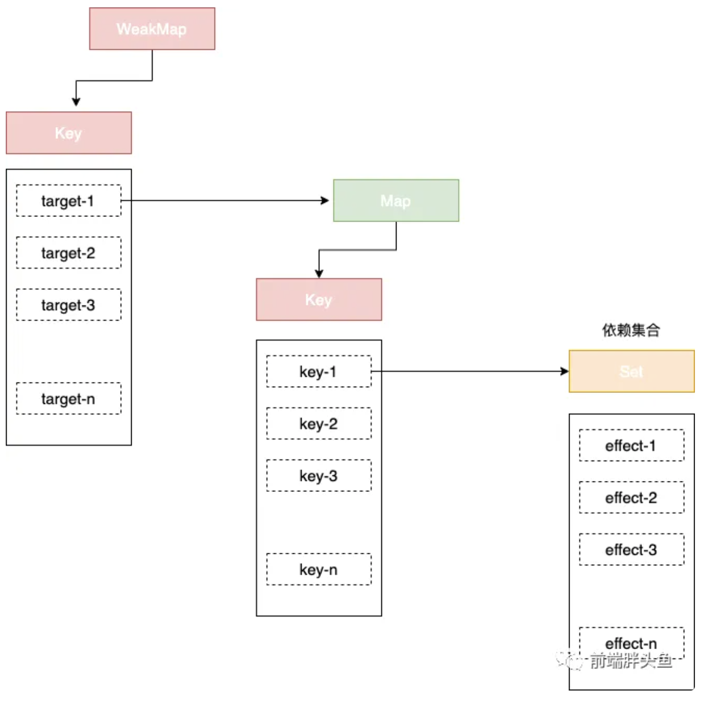

### 1、动态改变< div id="app">中内容
- 第一步：收集依赖(effect函数)，在读取key时，将effect函数存储起来
- 第二步：设置值时，将依赖(effect函数)执行
```
const $app = document.querySelector('#app')
const bucket = new Set()
   
const state = new Proxy({ text: 'hello js' }, {
  get (target, key) {
    const value = target[ key ]
    // 第一步：收集依赖，在读取key时，将effect函数存储起来
    bucket.add(effect)
    console.log(`get ${key}: ${value}`)
    return value
  },
  set (target, key, newValue) {
    console.log(`set ${key}: ${newValue}`)

    target[ key ] = newValue
    // 第二步：设置值时，将依赖执行
    bucket.forEach((fn) => fn())
  }
})

function effect() {
  console.log('执行了effect')
  $app.innerText = state.text
}

effect()

setTimeout(() => {
  state.text = 'hello Vue3'
}, 1000)
```

### 2、支持多属性响应式修改和主动注册
```
const bucket = new Set()

let activeEffect
// 变化点：
// 通过effect函数来主动收集依赖
const effect = function (fn) {
  // 每执行一次，将当前fn赋值给activeEffect,这样在fn中触发读取操作时，就可以被收集进bucket中了
  activeEffect = fn
  // 主动执行一次很重要，必不可少
  fn()
}
const state = new Proxy({ text: 'hello js', text2: 'hello js2' }, {
  get (target, key) {
    const value = target[ key ]
    // 变化点：由版本1的effect变成了activeEffect,从而不再依赖具体的函数名字
    bucket.add(activeEffect)
    console.log(`get ${key}: ${value}`)
    return value
  },
  set (target, key, newValue) {
    console.log(`set ${key}: ${newValue}`)

    target[ key ] = newValue
    bucket.forEach((fn) => fn())
  }
})

effect(function effect1 () {
  console.log('执行了effect1')
  $app1.innerText = state.text
})

effect(function effect2() {
  console.log('执行了effect2')
  $app2.innerText = state.text2
})

setTimeout(() => {
  state.text = 'hello Vue3'
  state.text2 = 'hello Vue3-2'
}, 1000)
```

### 3、增加一个之前不存在的属性，bucket却会把收集的依赖执行一次
在effect函数与被操作的目标字段之间建立明确的联系
```
state1
     |__text1
        |__effectFn1

state2
     |__text2
        |__effectFn2
```


```
const $app = document.querySelector('#app')
// 重新定义bucket数据类型为WeakMap
const bucket = new WeakMap()
let activeEffect
const effect = function (fn) {
  activeEffect = fn
  fn()
}
const state = new Proxy({ name: 'fatfish', age: 100 }, {
  get (target, key) {
    const value = target[ key ]
    // activeEffect无值意味着没有执行effect函数，无法收集依赖，直接return掉
    if (!activeEffect) {
      return
    }
    // 每个target在bucket中都是一个Map类型：key => effects
    let depsMap = bucket.get(target)
    // 第一次拦截，depsMap不存在，先创建联系
    if (!depsMap) {
      bucket.set(target, (depsMap = new Map()))
    }
    // 根据当前读取的key，尝试读取key的effects函数
    let deps = depsMap.get(key)

    if (!deps) {
      // deps本质是个Set结构，即一个key可以存在多个effect函数，被多个effect所依赖
      depsMap.set(key, (deps = new Set()))
    }
    // 将激活的effectFn存进桶中
    deps.add(activeEffect)

    console.log(`get ${key}: ${value}`)
    return value
  },
  set (target, key, newValue) {
    console.log(`set ${key}: ${newValue}`)
    // 设置属性值
    target[ key ] = newValue
    // 读取depsMap 其结构是 key => effects
    const depsMap = bucket.get(target)

    if (!depsMap) {
      return
    }
    // 真正读取依赖当前属性值key的effects
    const effects = depsMap.get(key)
    // 挨个执行即可
    effects && effects.forEach((fn) => fn())
  }
})

effect(() => {
  console.log('执行了effect')
  $app.innerText = `hello ${ state.name }, are you ${state.age} years old?`
})

setTimeout(() => {
  state.name = 'Vue3'
  state.age = 18
}, 1000)
```

### 4、再封装一下，像Vue3使用reactive一样
1、借助Proxy将一个对象obj变成响应式数据，拦截其get和set操作。
2、通过effect注册副作用函数，并在首次执行副作用函数时完成obj对象的依赖收集（track）。
3、当数据发生变化的时候，第2步注册的副作用函数会重新执行（trigger）。
```
const bucket = new WeakMap()
// 重新定义bucket数据类型为WeakMap
let activeEffect
const effect = function (fn) {
  activeEffect = fn
  fn()
}
// track表示追踪的意思
function track (target, key) {
  // activeEffect无值意味着没有执行effect函数，无法收集依赖，直接return掉
  if (!activeEffect) {
    return
  }
  // 每个target在bucket中都是一个Map类型：key => effects
  let depsMap = bucket.get(target)
  // 第一次拦截，depsMap不存在，先创建联系
  if (!depsMap) {
    bucket.set(target, (depsMap = new Map()))
  }
  // 根据当前读取的key，尝试读取key的effects函数  
  let deps = depsMap.get(key)

  if (!deps) {
    // deps本质是个Set结构，即一个key可以存在多个effect函数，被多个effect所依赖
    depsMap.set(key, (deps = new Set()))
  }
  // 将激活的effectFn存进桶中
  deps.add(activeEffect)
}
// trigger执行依赖
function trigger (target, key) {
  // 读取depsMap 其结构是 key => effects
  const depsMap = bucket.get(target)

  if (!depsMap) {
    return
  }
  // 真正读取依赖当前属性值key的effects
  const effects = depsMap.get(key)
  // 挨个执行即可
  effects && effects.forEach((fn) => fn())
}
// 统一对外暴露响应式函数
function reactive (state) {
  return new Proxy(state, {
    get (target, key) {
      const value = target[ key ]

      track(target, key)
      console.log(`get ${key}: ${value}`)
      return value
    },
    set (target, key, newValue) {
      console.log(`set ${key}: ${newValue}`)
      // 设置属性值
      target[ key ] = newValue

      trigger(target, key)
    }
  })
}
```
有了上面的封装，像Vue3一样使用
```
const $app = document.querySelector('#app')

const nameObj = reactive({
  name: 'fatfish'
})
const ageObj = reactive({
  age: 100
})

effect(() => {
  console.log('执行了effect')
  $app.innerText = `hello ${ nameObj.name }, are you ${ageObj.age} years old?`
})

setTimeout(() => {
  nameObj.name = 'Vue3'
}, 1000)

setTimeout(() => {
  ageObj.age = 18
}, 2000)
```